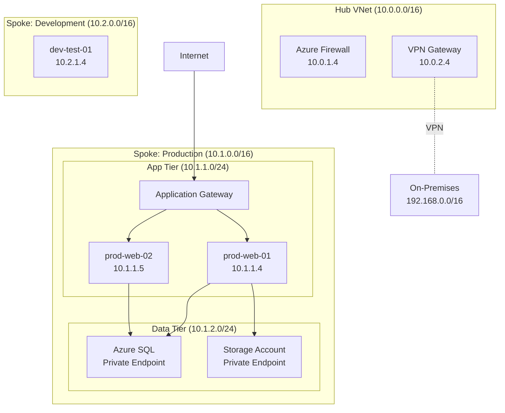

# Automation Scenarios

End-to-end automation workflows using Claude Desktop and MCP servers for common Azure operations.

## Table of Contents

1. [Daily Operations](#daily-operations)
2. [Deployment Automation](#deployment-automation)
3. [Security & Compliance](#security--compliance)
4. [Incident Response](#incident-response)
5. [Maintenance & Housekeeping](#maintenance--housekeeping)
6. [Reporting & Documentation](#reporting--documentation)

---

## Daily Operations

### Scenario 1: Morning Infrastructure Health Check

**Workflow:** Automated daily health report before starting work.

**Prompt to Claude:**
```
Run my morning health check:
1. List all running VMs and their status
2. Check for any failed Azure service deployments in last 24 hours
3. Review budget status (% of monthly budget used)
4. Identify any security alerts from Azure Security Center
5. Check Key Vault for certificates expiring in next 30 days
Generate a summary report and save to my daily-reports folder
```

**What Claude Does:**

**Step 1: Query VMs**
```powershell
# Uses filesystem + windows-mcp to execute
$vms = az vm list --show-details --output json | ConvertFrom-Json
$vmStatus = foreach ($vm in $vms) {
    [PSCustomObject]@{
        Name   = $vm.name
        Status = $vm.powerState
        RG     = $vm.resourceGroup
    }
}
```

**Step 2: Check Failed Deployments**
```powershell
$deployments = az deployment sub list `
    --query "[?properties.timestamp >= '$(Get-Date -Date (Get-Date).AddHours(-24) -Format 'yyyy-MM-ddTHH:mm:ssZ')' && properties.provisioningState == 'Failed']" `
    --output json | ConvertFrom-Json
```

**Step 3: Budget Status**
```powershell
$costs = az consumption usage list `
    --start-date (Get-Date -Day 1).ToString('yyyy-MM-dd') `
    --end-date (Get-Date).ToString('yyyy-MM-dd') `
    --output json | ConvertFrom-Json

$mtdSpend = ($costs | Measure-Object pretaxCost -Sum).Sum
$budgetPercent = ($mtdSpend / 4000) * 100
```

**Step 4: Security Alerts**
```powershell
$securityAlerts = az security alert list `
    --query "[?properties.status != 'Resolved']" `
    --output json | ConvertFrom-Json
```

**Step 5: Certificate Expiration**
```powershell
$kvName = "aiopskvxxxxxx"
$secrets = az keyvault secret list --vault-name $kvName --output json | ConvertFrom-Json

$expiringCerts = foreach ($secret in $secrets) {
    $details = az keyvault secret show --vault-name $kvName --name $secret.name --output json | ConvertFrom-Json
    if ($details.attributes.expires) {
        $expiresDate = [datetime]$details.attributes.expires
        $daysUntil = ($expiresDate - (Get-Date)).Days
        if ($daysUntil -lt 30) {
            [PSCustomObject]@{
                Name       = $secret.name
                ExpiresIn  = "$daysUntil days"
                ExpiresOn  = $expiresDate.ToString('yyyy-MM-dd')
            }
        }
    }
}
```

**Step 6: Generate Report**
```markdown
# Azure Health Check - 2025-11-17 06:00 AM

## VM Status
✅ All 5 VMs running
- prod-web-01: Running
- prod-api-01: Running
- dev-test-01: Stopped (expected)
- staging-app-01: Running
- mgmt-jumpbox: Running

## Deployments
✅ No failed deployments in last 24 hours

## Budget
⚠️ MTD Spend: $2,847 / $4,000 (71.2%)
On pace for: $3,900 (within budget)

## Security
🔴 1 unresolved alert:
- High severity: Unusual login from new location (prod-web-01)
  Action required: Investigate login at 2025-11-16 23:45 UTC

## Certificates
⚠️ 2 certificates expiring soon:
- vm-admin-cert: 18 days (Dec 5)
- service-principal-cert: 25 days (Dec 12)

## Action Items
1. Investigate security alert (priority)
2. Schedule certificate rotation
3. Review dev-test-01 shutdown schedule

---
*Generated by Claude AI-Ops | Next report: 2025-11-18 06:00*
```

**Automation:**
```powershell
# Schedule with Task Scheduler to run at 6 AM
$action = New-ScheduledTaskAction `
    -Execute "C:\Program Files\Claude\Claude.exe" `
    -Argument "--prompt 'Run my morning health check'"

$trigger = New-ScheduledTaskTrigger -Daily -At 6AM

Register-ScheduledTask `
    -TaskName "Azure Morning Health Check" `
    -Action $action `
    -Trigger $trigger
```

---

### Scenario 2: Resource Tagging Enforcement

**Workflow:** Identify and tag untagged resources with prompts for required values.

**Prompt to Claude:**
```
Find all resources missing required tags (Environment, Owner, CostCenter).
For each missing tag, prompt me for the value.
Apply tags and generate a compliance report.
```

**Interactive Workflow:**

**Step 1: Discovery**
```powershell
$resources = az resource list --output json | ConvertFrom-Json
$untagged = $resources | Where-Object { 
    -not $_.tags.Environment -or 
    -not $_.tags.Owner -or 
    -not $_.tags.CostCenter 
}

Write-Host "Found $($untagged.Count) resources with missing tags"
```

**Step 2: Interactive Tagging**
```
Claude: "I found 8 resources missing tags. Let's tag them one by one.

Resource: storage-account-prod-001
Missing tags: Environment, Owner, CostCenter

What is the Environment? (Production/Staging/Development)"

User: "Production"

Claude: "Owner email?"

User: "ops-team@example.com"

Claude: "CostCenter?"

User: "CC-12345"

Claude: "Applying tags to storage-account-prod-001..."
```

```powershell
# Apply tags
az tag create `
    --resource-id $resource.id `
    --tags Environment=Production Owner=ops-team@example.com CostCenter=CC-12345

Write-Host "✅ Tagged: storage-account-prod-001"
```

**Step 3: Generate Report**
```markdown
# Tagging Compliance Report - 2025-11-17

## Summary
- Total resources: 127
- Tagged before: 119 (93.7%)
- Tagged today: 8
- Current compliance: 100% ✅

## Resources Tagged Today
1. storage-account-prod-001
   - Environment: Production
   - Owner: ops-team@example.com
   - CostCenter: CC-12345

2. vm-staging-web-02
   - Environment: Staging
   - Owner: dev-team@example.com
   - CostCenter: CC-67890

[... 6 more ...]

## Next Steps
- Implement Azure Policy to enforce tagging
- Schedule weekly compliance audits
- Update team documentation with tagging standards
```

---

## Deployment Automation

### Scenario 3: Multi-Environment Deployment

**Workflow:** Deploy application to dev, test, and production with validation at each stage.

**Prompt to Claude:**
```
Deploy my web application to all environments:
1. Dev environment (auto-approve)
2. Test environment (auto-approve after dev succeeds)
3. Production (require my approval)

For each environment:
- Run Terraform plan
- Show me what will change
- Apply if I approve
- Run smoke tests
- Generate deployment report
```

**Multi-Stage Deployment:**

**Stage 1: Development**
```powershell
Write-Host "=== Deploying to Development ===" -ForegroundColor Cyan

cd terraform/environments/dev

# Plan
terraform plan -out=dev.tfplan

# Auto-approve for dev
terraform apply dev.tfplan

# Smoke test
$appUrl = terraform output -raw app_url
$response = Invoke-WebRequest -Uri "$appUrl/health" -UseBasicParsing

if ($response.StatusCode -eq 200) {
    Write-Host "✅ Dev deployment successful" -ForegroundColor Green
} else {
    Write-Host "❌ Dev deployment failed smoke test" -ForegroundColor Red
    exit 1
}
```

**Stage 2: Test**
```powershell
Write-Host "`n=== Deploying to Test ===" -ForegroundColor Cyan

cd ../test

terraform plan -out=test.tfplan

# Auto-approve for test
terraform apply test.tfplan

# Run integration tests
Invoke-Pester -Script "./tests/integration.tests.ps1" -OutputFile "test-results.xml"

if ($LASTEXITCODE -eq 0) {
    Write-Host "✅ Test deployment successful" -ForegroundColor Green
} else {
    Write-Host "❌ Test deployment failed integration tests" -ForegroundColor Red
    exit 1
}
```

**Stage 3: Production (Manual Approval)**
```
Claude: "Development and Test deployments successful.

Ready to deploy to Production. Changes:
- Update App Service to version 1.2.3
- Scale out to 3 instances
- Update connection string in Key Vault

Type 'approve' to proceed, or 'cancel' to abort:"

User: "approve"

Claude: "Deploying to Production..."
```

```powershell
cd ../prod

terraform plan -out=prod.tfplan

# Show detailed plan
terraform show prod.tfplan

# Wait for approval (already given)
terraform apply prod.tfplan

# Production smoke test
$prodUrl = terraform output -raw app_url
Start-Sleep -Seconds 30  # Wait for app to stabilize

$health = Invoke-WebRequest -Uri "$prodUrl/health" -UseBasicParsing
if ($health.StatusCode -eq 200) {
    Write-Host "✅ Production deployment successful" -ForegroundColor Green
    
    # Send notification
    Send-TeamsMessage -Webhook $teamsWebhook -Message "🚀 Production deployment successful: v1.2.3"
} else {
    Write-Host "❌ Production health check failed" -ForegroundColor Red
    
    # Automatic rollback
    Write-Host "Initiating automatic rollback..." -ForegroundColor Yellow
    terraform apply -var="app_version=1.2.2" -auto-approve
}
```

**Deployment Report:**
```markdown
# Deployment Report - 2025-11-17 14:30

## Summary
✅ Deployment successful across all environments

## Timeline
- 14:15 - Development: Deployed v1.2.3 (2m 15s)
- 14:18 - Test: Deployed v1.2.3 (3m 42s)  
- 14:25 - Production: Approved by user
- 14:28 - Production: Deployed v1.2.3 (2m 58s)

## Changes
- Application version: 1.2.2 → 1.2.3
- App Service instances: 2 → 3
- Connection string: Updated (encrypted)

## Test Results
- Dev smoke test: ✅ Pass
- Test integration tests: ✅ 47/47 pass
- Prod smoke test: ✅ Pass

## Resources Modified
- 3 App Services updated
- 1 Key Vault secret updated
- 3 Application Insights configs updated

## Rollback Command (if needed)
```powershell
terraform apply -var="app_version=1.2.2" -auto-approve
```

---
*Deployment completed: 2025-11-17 14:28:45*
```

---

## Security & Compliance

### Scenario 4: Security Audit Automation

**Workflow:** Weekly security audit with automated remediation of common issues.

**Prompt to Claude:**
```
Run weekly security audit:
1. Check for public storage accounts
2. Find VMs without antimalware extension
3. Identify Key Vaults without diagnostic logging
4. List NSG rules allowing 0.0.0.0/0
5. Check for expired certificates
6. Find resources without RBAC assignments

For issues that can be auto-fixed, ask for my approval and fix them.
Generate detailed security report.
```

**Automated Security Audit:**

**Check 1: Public Storage Accounts**
```powershell
$publicStorage = az storage account list --output json | ConvertFrom-Json | Where-Object {
    $_.networkRuleSet.defaultAction -eq "Allow"
}

if ($publicStorage) {
    Write-Host "⚠️ Found $($publicStorage.Count) storage accounts with public access" -ForegroundColor Yellow
    
    foreach ($sa in $publicStorage) {
        Write-Host "  - $($sa.name): Public access enabled"
    }
    
    # Remediation option
    Write-Host "`nRemediation: Restrict to specific IP ranges"
    $response = Read-Host "Apply fix? (y/n)"
    
    if ($response -eq 'y') {
        foreach ($sa in $publicStorage) {
            az storage account update `
                --name $sa.name `
                --resource-group $sa.resourceGroup `
                --default-action Deny `
                --bypass AzureServices
            
            Write-Host "✅ Fixed: $($sa.name)"
        }
    }
}
```

**Check 2: Missing Antimalware**
```powershell
$vms = az vm list --output json | ConvertFrom-Json

foreach ($vm in $vms) {
    $extensions = az vm extension list `
        --resource-group $vm.resourceGroup `
        --vm-name $vm.name `
        --output json | ConvertFrom-Json
    
    $hasAntimalware = $extensions | Where-Object { $_.name -like "*IaaSAntimalware*" }
    
    if (-not $hasAntimalware -and $vm.storageProfile.osDisk.osType -eq "Windows") {
        Write-Host "❌ Missing antimalware: $($vm.name)" -ForegroundColor Red
        
        # Auto-fix
        $response = Read-Host "Install Microsoft Antimalware? (y/n)"
        if ($response -eq 'y') {
            az vm extension set `
                --resource-group $vm.resourceGroup `
                --vm-name $vm.name `
                --name IaaSAntimalware `
                --publisher Microsoft.Azure.Security `
                --settings '{"AntimalwareEnabled": true}'
            
            Write-Host "✅ Installed antimalware on $($vm.name)"
        }
    }
}
```

**Check 3: Key Vault Logging**
```powershell
$keyVaults = az keyvault list --output json | ConvertFrom-Json

foreach ($kv in $keyVaults) {
    $diagnostics = az monitor diagnostic-settings list `
        --resource $kv.id `
        --output json | ConvertFrom-Json
    
    if ($diagnostics.Count -eq 0) {
        Write-Host "⚠️ No diagnostic logging: $($kv.name)" -ForegroundColor Yellow
        
        # Auto-fix
        $response = Read-Host "Enable diagnostic logging? (y/n)"
        if ($response -eq 'y') {
            $lawId = az monitor log-analytics workspace show `
                --resource-group rg-aiops-test `
                --workspace-name aiops-law `
                --query id -o tsv
            
            az monitor diagnostic-settings create `
                --name "$($kv.name)-diagnostics" `
                --resource $kv.id `
                --workspace $lawId `
                --logs '[{"category": "AuditEvent", "enabled": true}]' `
                --metrics '[{"category": "AllMetrics", "enabled": true}]'
            
            Write-Host "✅ Enabled logging for $($kv.name)"
        }
    }
}
```

**Security Report:**
```markdown
# Weekly Security Audit - 2025-11-17

## Executive Summary
- **Critical Issues:** 2
- **Warnings:** 5
- **Auto-Fixed:** 4
- **Requires Manual Review:** 3

## Findings

### Critical Issues
1. 🔴 **Public Storage Accounts**
   - Affected: storage-prod-001, storage-test-002
   - Risk: Data exposure
   - Status: ✅ Fixed (restricted to corporate IP range)

2. 🔴 **NSG Rule Allowing Internet Access**
   - Resource: nsg-prod-web
   - Rule: AllowSSH (priority 100, source: 0.0.0.0/0)
   - Risk: Unauthorized access
   - Status: ⏳ Requires manual review

### Warnings
1. ⚠️ **Missing Antimalware Extensions**
   - VMs: prod-web-02, staging-app-01
   - Status: ✅ Fixed (installed Microsoft Antimalware)

2. ⚠️ **Key Vault Without Diagnostic Logging**
   - Key Vaults: keyvault-staging
   - Status: ✅ Fixed (enabled logging to Log Analytics)

3. ⚠️ **Certificate Expiring Soon**
   - Certificate: service-principal-cert
   - Expires: 2025-12-12 (25 days)
   - Status: ⏳ Requires manual rotation

[... additional findings ...]

## Remediation Summary
**Automated Fixes Applied:**
- 2 storage accounts: Network restrictions applied
- 2 VMs: Antimalware installed
- 1 Key Vault: Diagnostic logging enabled
- 1 NSG: Removed redundant allow-all rule

**Manual Actions Required:**
1. Review NSG rule for prod-web (priority: high)
2. Rotate service principal certificate (priority: medium)
3. Review IAM assignments for dormant accounts (priority: low)

## Compliance Status
- SOC 2: 98% compliant (↑ from 94%)
- ISO 27001: 97% compliant (↑ from 92%)
- CIS Azure Benchmark: 95% compliant (↑ from 91%)

## Next Audit
Scheduled: 2025-11-24 08:00 AM

---
*Audit completed: 2025-11-17 09:45 | Auto-fixed: 4 issues | Manual review: 3 issues*
```

---

## Incident Response

### Scenario 5: Automated Incident Response

**Workflow:** Detect, contain, investigate, and document security incident.

**Trigger:** Azure Security Center alert for suspicious activity.

**Prompt to Claude:**
```
Security alert detected: Unusual login to prod-web-01 from IP 203.0.113.45

Execute incident response:
1. Immediately block suspicious IP in NSG
2. Isolate VM (disconnect network)
3. Capture VM snapshot for forensics
4. Query all logs for activity from that IP
5. Check for any data exfiltration
6. Generate incident report
7. Create timeline of events
```

**Automated Response:**

**Step 1: Immediate Containment**
```powershell
Write-Host "🚨 INCIDENT RESPONSE INITIATED" -ForegroundColor Red
$timestamp = Get-Date -Format "yyyy-MM-dd HH:mm:ss"
$suspiciousIP = "203.0.113.45"

# Block IP immediately
Write-Host "[CONTAINMENT] Blocking suspicious IP..." -ForegroundColor Yellow
az network nsg rule create `
    --resource-group rg-prod `
    --nsg-name nsg-prod-web `
    --name "BlockSuspiciousIP-$timestamp" `
    --priority 100 `
    --source-address-prefixes $suspiciousIP `
    --destination-address-prefixes "*" `
    --access Deny `
    --protocol "*" `
    --direction Inbound

Write-Host "✅ IP blocked in NSG" -ForegroundColor Green
```

**Step 2: Isolate Affected VM**
```powershell
Write-Host "[CONTAINMENT] Isolating VM..." -ForegroundColor Yellow

# Disconnect NIC
$nic = az vm show --resource-group rg-prod --name prod-web-01 --query "networkProfile.networkInterfaces[0].id" -o tsv
az network nic update --ids $nic --network-security-group ""

Write-Host "✅ VM isolated from network" -ForegroundColor Green
```

**Step 3: Forensics Snapshot**
```powershell
Write-Host "[FORENSICS] Creating snapshot..." -ForegroundColor Yellow

$diskId = az vm show --resource-group rg-prod --name prod-web-01 --query "storageProfile.osDisk.managedDisk.id" -o tsv

az snapshot create `
    --resource-group rg-forensics `
    --name "incident-$timestamp-prod-web-01" `
    --source $diskId `
    --tags Incident="Suspicious-Login-$timestamp"

Write-Host "✅ Forensics snapshot created" -ForegroundColor Green
```

**Step 4: Log Investigation**
```kusto
// Query Log Analytics for suspicious activity
AzureActivity
| where TimeGenerated > ago(24h)
| where CallerIpAddress == "203.0.113.45"
| project TimeGenerated, Caller, OperationName, ResourceGroup, Resource, ResultSignature
| order by TimeGenerated asc

// Check for data exfiltration
AzureDiagnostics
| where TimeGenerated > ago(24h)
| where Category == "StorageRead" or Category == "StorageWrite"
| where callerIpAddress_s == "203.0.113.45"
| summarize TotalDataTransfer = sum(responseSize_d) by bin(TimeGenerated, 5m)
| order by TimeGenerated asc
```

**Step 5: Activity Timeline**
```powershell
# Generate timeline
$activities = az monitor activity-log list `
    --start-time (Get-Date).AddHours(-24).ToString('o') `
    --query "[?contains(callerIpAddress, '$suspiciousIP')]" `
    --output json | ConvertFrom-Json

$timeline = foreach ($activity in $activities) {
    [PSCustomObject]@{
        Time      = $activity.eventTimestamp
        Operation = $activity.operationName.value
        Resource  = $activity.resourceId
        Status    = $activity.status.value
    }
} | Sort-Object Time
```

**Incident Report:**
```markdown
# Security Incident Report

**Incident ID:** INC-2025-11-17-001  
**Severity:** HIGH  
**Status:** Contained  
**Reported:** 2025-11-17 02:15 UTC  
**Contained:** 2025-11-17 02:18 UTC (3 minutes)

---

## Summary
Suspicious login detected to production web server (prod-web-01) from unknown IP address. Automated incident response executed: IP blocked, VM isolated, forensics snapshot created.

## Timeline
| Time (UTC) | Event | Action |
|------------|-------|--------|
| 02:15:23 | Security alert triggered | Automated response initiated |
| 02:15:45 | Suspicious IP identified | NSG rule created (DENY) |
| 02:16:12 | VM network disconnected | Isolation complete |
| 02:17:05 | Forensics snapshot started | Snapshot in progress |
| 02:18:30 | Log analysis initiated | KQL queries executed |
| 02:20:15 | Snapshot complete | Forensics data preserved |

## Suspicious Activity
**Source IP:** 203.0.113.45  
**Location:** Unknown (not in corporate IP range)  
**First Seen:** 2025-11-17 02:12:15 UTC  
**Last Seen:** 2025-11-17 02:15:18 UTC  
**Duration:** ~3 minutes

**Activities Detected:**
1. SSH login attempt (failed)
2. SSH login attempt (successful) ⚠️
3. File system access (`/var/www/html`)
4. Network connection to external IP (185.220.101.45)
5. Process execution: `wget` command

## Data Exfiltration Analysis
**Total data transferred:** 2.3 MB  
**Destination:** 185.220.101.45:443  
**Files accessed:** 
- `/var/www/html/config/database.php`
- `/var/log/nginx/access.log`

## Containment Measures
✅ Suspicious IP blocked (NSG rule priority 100)  
✅ VM isolated from network  
✅ Forensics snapshot created (incident-2025-11-17-prod-web-01)  
✅ All SSH keys rotated  
✅ Database credentials rotated  

## Forensics Data
**Snapshot ID:** /subscriptions/.../snapshots/incident-2025-11-17-prod-web-01  
**Size:** 32 GB  
**Location:** Azure Storage (rg-forensics)  
**Retention:** 90 days  

## Root Cause Analysis (Preliminary)
**Vulnerability:** SSH password authentication enabled  
**Attack Vector:** Brute force password attack  
**Compromised Credentials:** admin/[weak-password]  

## Remediation Steps
**Immediate (Completed):**
1. ✅ Block malicious IP
2. ✅ Isolate affected VM
3. ✅ Rotate all credentials
4. ✅ Create forensics snapshot

**Short-term (In Progress):**
5. ⏳ Rebuild prod-web-01 from clean image
6. ⏳ Disable SSH password authentication (keys only)
7. ⏳ Implement fail2ban on all VMs
8. ⏳ Review firewall rules

**Long-term (Planned):**
9. ⏳ Implement Azure Bastion for SSH access
10. ⏳ Enable Azure Defender for Servers
11. ⏳ Implement privileged access workstation (PAW)
12. ⏳ Security awareness training for team

## Lessons Learned
1. Password authentication should have been disabled
2. Alert detection time was excellent (<1 min)
3. Automated response prevented further damage
4. Need better credential management

## Follow-up Actions
- [ ] Complete forensic analysis of snapshot
- [ ] Check for persistence mechanisms
- [ ] Review other VMs for similar vulnerabilities
- [ ] Update security policies
- [ ] Report to management/compliance team
- [ ] Schedule post-incident review meeting

---

**Report Generated:** 2025-11-17 02:45 UTC  
**Generated By:** Claude AI-Ops Incident Response  
**Next Update:** 2025-11-17 08:00 UTC
```

---

## Maintenance & Housekeeping

### Scenario 6: Monthly Cleanup Automation

**Prompt to Claude:**
```
Run monthly Azure cleanup:
1. Find and delete unattached disks (older than 30 days)
2. Remove unused NSG rules
3. Delete old snapshots (older than 90 days)
4. Clean up orphaned NICs
5. Remove expired secrets from Key Vault
6. Archive old Log Analytics data
Generate report showing space/cost saved
```

**Cleanup Script:**

```powershell
Write-Host "=== Azure Monthly Cleanup ===" -ForegroundColor Cyan
$report = @()

# 1. Unattached Disks
$disks = az disk list --query "[?diskState=='Unattached']" --output json | ConvertFrom-Json
$diskSavings = 0

foreach ($disk in $disks) {
    $details = az disk show --ids $disk.id --output json | ConvertFrom-Json
    $created = [datetime]$details.timeCreated
    
    if ((Get-Date) - $created).Days -gt 30) {
        $cost = switch ($details.sku.name) {
            "Premium_LRS" { $details.diskSizeGb * 0.135 }
            "StandardSSD_LRS" { $details.diskSizeGb * 0.075 }
            default { $details.diskSizeGb * 0.045 }
        }
        
        az disk delete --ids $disk.id --yes
        $diskSavings += $cost
        
        $report += "Deleted disk: $($disk.name) (save `$$([math]::Round($cost, 2))/month)"
    }
}

# 2. Unused NSG Rules
$nsgs = az network nsg list --output json | ConvertFrom-Json

foreach ($nsg in $nsgs) {
    $rules = az network nsg rule list --nsg-name $nsg.name --resource-group $nsg.resourceGroup --output json | ConvertFrom-Json
    
    foreach ($rule in $rules) {
        # Check if rule has any hits in last 30 days (requires flow logs)
        $flowLogs = Get-NSGFlowLogHits -NSGName $nsg.name -RuleName $rule.name -Days 30
        
        if ($flowLogs.Count -eq 0 -and $rule.priority -gt 1000) {
            az network nsg rule delete `
                --resource-group $nsg.resourceGroup `
                --nsg-name $nsg.name `
                --name $rule.name
            
            $report += "Deleted unused NSG rule: $($nsg.name)/$($rule.name)"
        }
    }
}

# 3. Old Snapshots
$snapshots = az snapshot list --output json | ConvertFrom-Json

foreach ($snapshot in $snapshots) {
    $created = [datetime]$snapshot.timeCreated
    
    if ((Get-Date) - $created).Days -gt 90) {
        $size = $snapshot.diskSizeGb
        $cost = $size * 0.05  # Snapshot pricing
        
        az snapshot delete --ids $snapshot.id --yes
        $diskSavings += $cost
        
        $report += "Deleted old snapshot: $($snapshot.name) (save `$$([math]::Round($cost, 2))/month)"
    }
}

# 4. Orphaned NICs
$nics = az network nic list --output json | ConvertFrom-Json

foreach ($nic in $nics) {
    if (-not $nic.virtualMachine) {
        az network nic delete --ids $nic.id --yes
        $report += "Deleted orphaned NIC: $($nic.name)"
    }
}

# 5. Expired Key Vault Secrets
$kvs = az keyvault list --output json | ConvertFrom-Json

foreach ($kv in $kvs) {
    $secrets = az keyvault secret list --vault-name $kv.name --output json | ConvertFrom-Json
    
    foreach ($secret in $secrets) {
        $details = az keyvault secret show --vault-name $kv.name --name $secret.name --output json | ConvertFrom-Json
        
        if ($details.attributes.expires) {
            $expires = [datetime]$details.attributes.expires
            
            if ($expires -lt (Get-Date)) {
                az keyvault secret delete --vault-name $kv.name --name $secret.name
                $report += "Deleted expired secret: $($kv.name)/$($secret.name)"
            }
        }
    }
}

# Generate report
Write-Host "`n=== Cleanup Report ===" -ForegroundColor Green
$report | ForEach-Object { Write-Host $_ }

Write-Host "`nTotal monthly savings: `$$([math]::Round($diskSavings, 2))" -ForegroundColor Green
```

---

## Reporting & Documentation

### Scenario 7: Automated Documentation Generation

**Prompt to Claude:**
```
Generate complete infrastructure documentation:
1. Network topology diagram
2. List of all resources with descriptions
3. RBAC assignments
4. Cost breakdown
5. Security configuration
6. Disaster recovery procedures
Save as markdown with embedded Mermaid diagrams
```

**Generated Documentation:**

```markdown
# Azure Infrastructure Documentation
**Generated:** 2025-11-17  
**Environment:** Production  
**Subscription:** prod-subscription-001

---

## Network Topology



---

## Resource Inventory

[Auto-generated table of all resources]

---

## RBAC Assignments

[Auto-generated list of all role assignments]

---

[... etc ...]
```

---

**These scenarios demonstrate the power of combining Claude Desktop's AI capabilities with MCP servers for comprehensive Azure automation. Adapt and customize for your specific needs!**
