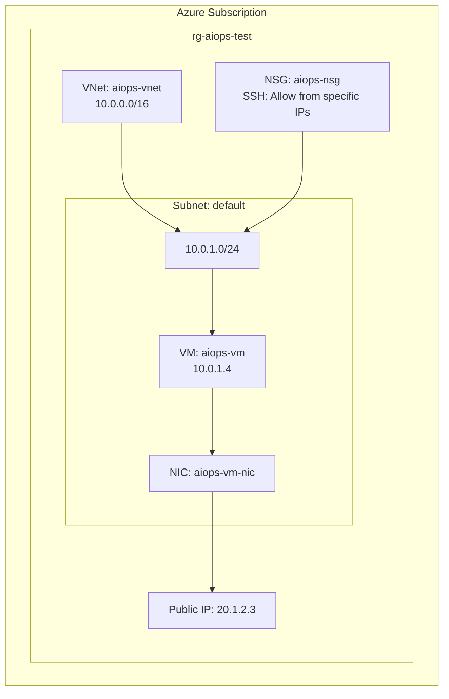

# Querying Azure Resources with Claude

This guide shows practical examples of using Claude Desktop with MCP servers to query and analyze Azure resources.

## Prerequisites

- AI-Ops environment deployed
- Claude Desktop configured with MCP servers
- Azure CLI authenticated

## Example Workflows

### 1. List All Resources in Subscription

**Prompt to Claude**:
```
Show me all resources in my Azure subscription. For each resource, show:
- Name
- Type
- Resource Group
- Location
- Tags
```

**What Claude Does**:
1. Uses Azure CLI or Azure Resource Graph
2. Queries all resources
3. Formats output as table
4. Saves results to file (optional)

**Expected Output**:
```
Resource Inventory:
┌──────────────────────┬─────────────────────┬──────────────────┬──────────┬───────────┐
│ Name                 │ Type                │ Resource Group   │ Location │ Tags      │
├──────────────────────┼─────────────────────┼──────────────────┼──────────┼───────────┤
│ aiops-vm-abc123      │ Microsoft.Compute   │ rg-aiops-test    │ eastus   │ Project:  │
│                      │ /virtualMachines    │                  │          │ AI-Ops    │
├──────────────────────┼─────────────────────┼──────────────────┼──────────┼───────────┤
│ aiopskvxyz789        │ Microsoft.KeyVault  │ rg-aiops-test    │ eastus   │ Project:  │
│                      │ /vaults             │                  │          │ AI-Ops    │
└──────────────────────┴─────────────────────┴──────────────────┴──────────┴───────────┘
```

---

### 2. Find Resources Without Required Tags

**Prompt to Claude**:
```
Find all resources that are missing the "Environment" or "CostCenter" tags. 
Create a report showing which resources need tagging.
```

**Azure Resource Graph Query** (that Claude might generate):
```kusto
Resources
| where tags !has "Environment" or tags !has "CostCenter"
| project 
    name,
    type,
    resourceGroup,
    location,
    tags,
    subscriptionId
| order by resourceGroup asc, name asc
```

**Claude's Actions**:
1. Runs KQL query via Azure Resource Graph
2. Formats results
3. Generates tagging script
4. Saves report to file

---

### 3. VM Status Report

**Prompt to Claude**:
```
Create a report of all VMs showing:
- Name and size
- Current power state
- OS type and version
- Public/private IPs
- Cost optimization opportunities
```

**PowerShell Script** (that Claude might create):
```powershell
# Get all VMs with status
$vms = az vm list --query "[].{Name:name, RG:resourceGroup}" | ConvertFrom-Json

$report = foreach ($vm in $vms) {
    $status = az vm get-instance-view `
        --resource-group $vm.RG `
        --name $vm.Name `
        --query "instanceView.statuses[?starts_with(code, 'PowerState/')].displayStatus" `
        --output tsv
    
    $details = az vm show --resource-group $vm.RG --name $vm.Name | ConvertFrom-Json
    
    [PSCustomObject]@{
        Name        = $vm.Name
        ResourceGroup = $vm.RG
        Size        = $details.hardwareProfile.vmSize
        PowerState  = $status
        OSType      = $details.storageProfile.osDisk.osType
        PublicIP    = (az vm list-ip-addresses -g $vm.RG -n $vm.Name --query "[0].virtualMachine.network.publicIpAddresses[0].ipAddress" -o tsv)
    }
}

$report | Format-Table -AutoSize
```

---

### 4. Network Topology Discovery

**Prompt to Claude**:
```
Map out my network topology showing:
- VNets and their address spaces
- Subnets and their usage
- Network security groups and key rules
- Connected resources
Create a Mermaid diagram
```

**Mermaid Diagram** (that Claude creates):


---

### 5. Storage Account Analysis

**Prompt to Claude**:
```
Analyze all storage accounts in my subscription:
- List containers and their sizes
- Show replication type
- Calculate monthly costs
- Identify optimization opportunities
```

**Analysis Output**:
```
Storage Account Analysis
========================

Account: aiopsstxyz789
├── Location: eastus
├── SKU: Standard_LRS
├── Containers: 
│   └── vm-diagnostics (2.3 GB)
├── Estimated Monthly Cost: $0.50
└── Optimization: Consider lifecycle management for old logs

Recommendations:
1. Enable soft delete for blob data
2. Set up lifecycle policies to archive old diagnostics
3. Consider upgrade to Premium for frequently accessed data
```

---

### 6. Cost by Resource Type

**Prompt to Claude**:
```
Show me Azure costs for the last 30 days, broken down by resource type.
Highlight the top 5 most expensive resources.
```

**Azure CLI Commands** (executed by Claude):
```powershell
# Get cost by resource type (last 30 days)
$startDate = (Get-Date).AddDays(-30).ToString('yyyy-MM-dd')
$endDate = (Get-Date).ToString('yyyy-MM-dd')

az consumption usage list `
    --start-date $startDate `
    --end-date $endDate `
    --query "groupBy(type, sum(pretaxCost))" `
    --output table
```

---

### 7. Security Configuration Audit

**Prompt to Claude**:
```
Audit security configurations for all resources:
- Check for public network access
- Verify encryption settings
- List NSG rules that allow 0.0.0.0/0
- Check Key Vault access policies
Generate a security report
```

**Security Report** (generated by Claude):
```markdown
# Security Audit Report
Date: 2025-11-17

## Critical Findings
1. ⚠️ Storage account has public network access enabled
2. ⚠️ NSG rule allows SSH from 0.0.0.0/0
3. ✓ Key Vault has soft delete enabled
4. ✓ All VMs use managed identities

## Recommendations
1. Restrict storage account to specific IP ranges
2. Update NSG rule to allow SSH only from corporate IP
3. Enable Azure Defender for all resource types
4. Implement Azure Policy for security baselines
```

---

### 8. Resource Dependency Mapping

**Prompt to Claude**:
```
For the VM 'aiops-vm-xyz', show me all dependent resources:
- Disks
- Network interfaces
- NSGs
- Public IPs
- Storage accounts (boot diagnostics)
Create a dependency tree
```

**Dependency Tree**:
```
aiops-vm-xyz (Virtual Machine)
├── OS Disk: aiops-vm-osdisk-xyz
├── Network Interface: aiops-vm-nic-xyz
│   ├── Public IP: aiops-vm-pip-xyz (20.1.2.3)
│   ├── Subnet: default (10.0.1.0/24)
│   │   └── VNet: aiops-vnet (10.0.0.0/16)
│   └── NSG: aiops-nsg-xyz
└── Boot Diagnostics: aiopsstxyz789
    └── Container: bootdiagnostics-aiopsvm
```

---

### 9. Compare Configurations Across Regions

**Prompt to Claude**:
```
I'm planning to deploy to West US 2. Compare current East US configuration 
with recommended settings for West US 2, including:
- Available VM sizes
- Pricing differences
- Network latency
- Compliance requirements
```

---

### 10. Generate ARM Template from Existing Resources

**Prompt to Claude**:
```
Export the current configuration of resource group 'rg-aiops-test' 
as an ARM template. Include all resources and dependencies.
```

**PowerShell Command**:
```powershell
az group export `
    --name rg-aiops-test `
    --include-comments `
    --include-parameter-default-value `
    > rg-aiops-test-template.json
```

---

## Advanced Queries with Azure Resource Graph

### Query 1: Find All Resources Modified in Last 24 Hours

**KQL Query**:
```kusto
ResourceChanges
| where timestamp > ago(24h)
| extend changeType = properties.changeType
| project timestamp, changeType, resourceType = properties.targetResourceType, 
          resourceName = properties.targetResourceId
| order by timestamp desc
```

### Query 2: Resources by Region with Cost

**KQL Query**:
```kusto
Resources
| join kind=leftouter (
    ResourceContainers
    | where type == 'microsoft.resources/subscriptions'
    | project subscriptionId, subscriptionName=name
) on subscriptionId
| extend location = location
| summarize count() by location
| order by count_ desc
```

### Query 3: Compliance - Resources Without Tags

**KQL Query**:
```kusto
Resources
| where tags !has "Environment" or 
        tags !has "Owner" or 
        tags !has "CostCenter"
| project name, type, resourceGroup, location, tags
| extend missingTags = 
    iff(tags !has "Environment", "Environment ", "") +
    iff(tags !has "Owner", "Owner ", "") +
    iff(tags !has "CostCenter", "CostCenter", "")
| order by resourceGroup asc
```

---

## Combining Multiple Tools

### Example: Complete VM Analysis

**Prompt to Claude**:
```
For VM 'aiops-vm-xyz', create a comprehensive analysis:
1. Current configuration and status
2. Performance metrics (last 7 days)
3. Cost analysis
4. Security posture
5. Optimization recommendations
Save as markdown report
```

**Claude's Workflow**:
1. **Filesystem**: Create report file
2. **Fetch**: Query Azure metrics API
3. **Azure CLI**: Get VM configuration
4. **Memory**: Remember similar analyses
5. **Filesystem**: Save final report

**Output**: `vm-aiops-analysis-20251117.md`

---

## Tips for Effective Queries

### 1. Be Specific About Output Format
```
Good: "Create a CSV file with VM names, sizes, and costs"
Bad:  "Show me VMs"
```

### 2. Request Error Handling
```
"Include try-catch blocks and validate resource existence before querying"
```

### 3. Ask for Explanations
```
"Explain the KQL query you're about to run and what it will return"
```

### 4. Iterate on Results
```
First: "Show me all VMs"
Then:  "Now add cost data"
Then:  "Sort by cost descending"
Finally: "Save to Excel format"
```

### 5. Use Memory for Context
```
"Remember that our production resource group is 'rg-prod' and 
our test resource group is 'rg-aiops-test'. Use this in future queries."
```

---

## Saving and Reusing Queries

### Create Query Library

**Prompt to Claude**:
```
Create a query library file with these KQL queries:
1. All VMs with costs
2. Untagged resources
3. Network topology
4. Storage analysis
Save as queries.kql with comments
```

**Result**: `queries.kql` file you can reference later

### Generate PowerShell Functions

**Prompt to Claude**:
```
Convert my KQL queries into PowerShell functions with:
- Parameter validation
- Error handling
- Output formatting
- Help comments
Save as AzureQueries.psm1 module
```

---

## Integration with Existing Tools

### Export to Excel
```
"Run the resource inventory query and export results to Excel with 
formatting, filters, and a pivot table showing costs by resource type"
```

### Generate Power BI Report
```
"Create a Power BI query that connects to Azure Resource Graph and 
shows real-time resource inventory with cost trending"
```

### Create Automation Runbook
```
"Convert this query into an Azure Automation runbook that runs daily 
and emails results to the team"
```

---

## Next Steps

- Review [Cost Analysis Examples](cost-analysis.md)
- Explore [Automation Scenarios](automation-scenarios.md)
- Check [Architecture Documentation](../docs/architecture.md)

**Remember**: Claude has access to your entire Azure environment through MCP servers. Always review generated scripts before executing, especially in production!
